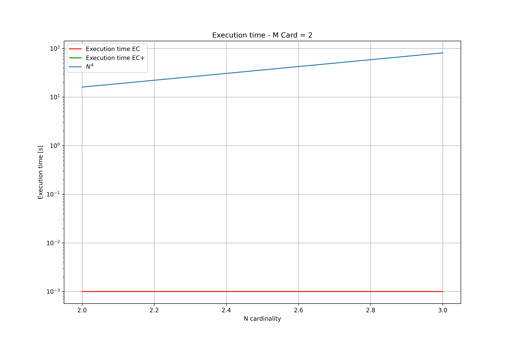
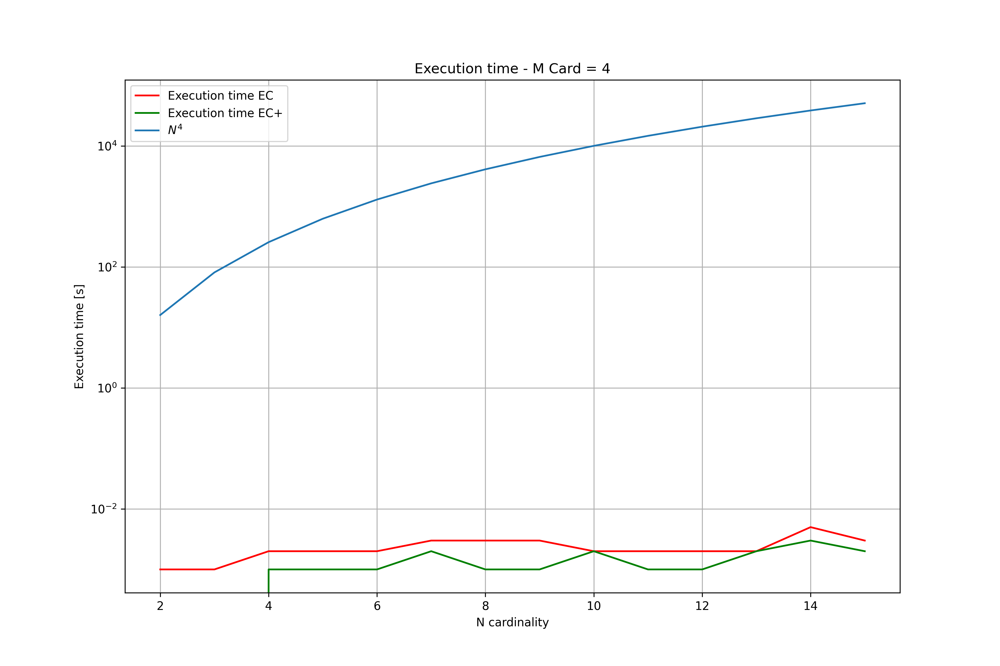
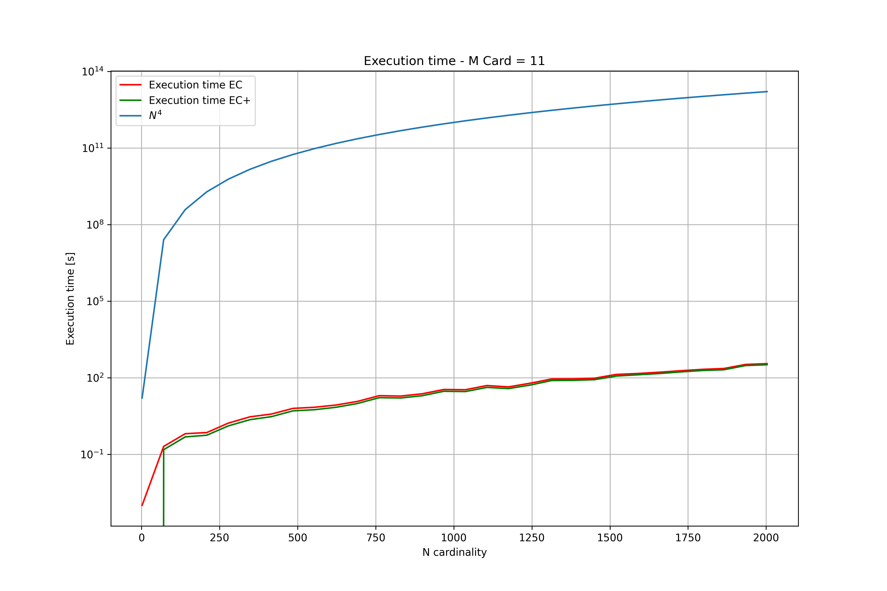
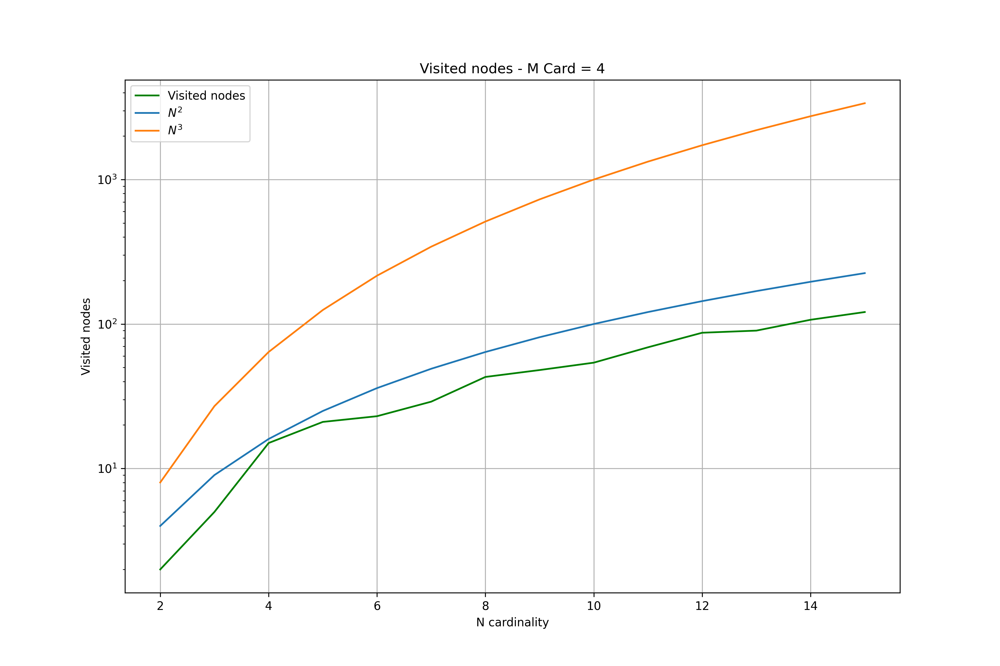
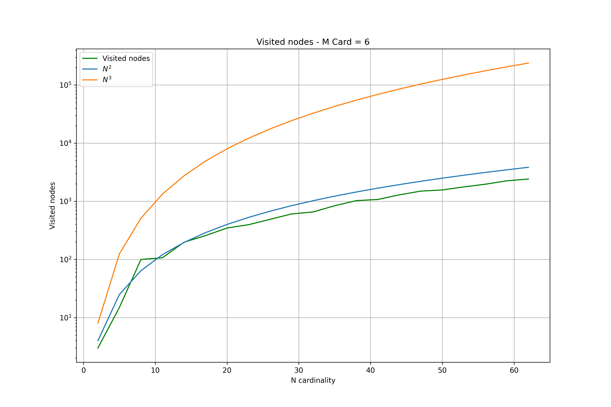
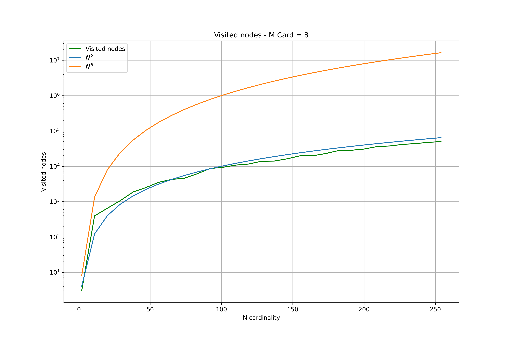
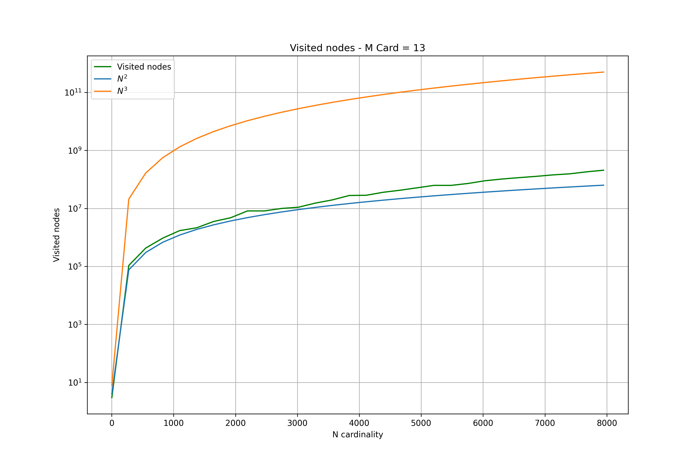

# Progetto Algoritmi e Strutture Dati

Progetto per il corso "Algoritmi e Strutture Dati" per la laurea magistrale in Ingegneria Informatica all'Università degli Studi di Brescia.

## Indice

<!-- TOC -->
* [Obiettivo del progetto](#obiettivo-del-progetto)
* [Implementazione](#implementazione)
* [Scelte progettuali](#scelte-progettuali)
* [Test](#test)
* [Grafici](#grafici)
  * [Tempo di esecuzione](#tempo-di-esecuzione)
  * [Numero di nodi visitati](#numero-di-nodi-visitati)
* [Conclusioni](#conclusioni)
<!-- TOC -->

## Obiettivo del progetto

Il progetto aveva lo scopo di andare ad analizzare e risolvere uno dei 21 problemi
classificati come NPC da Karp nel celebre articolo del 1972, il problema di decidere se
esista una partizione di M vincolata da N. Veniva richiesto di implementare un algoritmo
denominato EC (e una sua versione modificata EC+), che sta per Exact Cover, e andare a
studiare le complessità temporali e spaziali che derivavano dall'esecuzione di tale
algoritmo.
Per questo scopo ho deciso di realizzare il codice interamente in Python andando ad
implementare sia l'algoritmo EC che l'algoritmo EC+ andando ad aumentare il più possibile
il grado di riutilizzo del codice in quanto i due algoritmi sono molto simili tra loro.

## Implementazione

L'algoritmo da me proposto prende in input un file di testo e restituisce in output
un ulteriore file di testo che riporta:
- La copertura esatta (denominata COV)
- Il nome dell'algoritmo lanciato (EC oppure EC+)
- Il tempo di esecuzione dello script
- Il numero totale di nodi dell'albero esplorabili
- Il numero di nodi dell'albero esplorati
- La percentuale di nodi esplorati

La struttura di un file di input da fornire all'algoritmo `main.py` è questa:

```
;;; Questa linea è un commento e verrà ignorata
;;; Una riga del file per ogni riga della matrice A
;;; Su una riga ci sono gli elementi della matrice A spaziati tra di loro
;;; Al termine della riga c'è un simbolo - che indica la terminazione della riga
1 0 1 0 0 0 0 0 0 1 -
0 0 0 1 0 0 1 1 1 0 -
0 1 0 1 0 0 0 1 0 0 -
0 1 0 0 1 1 0 0 0 0 -
0 0 0 0 1 1 1 0 1 0 -
0 1 1 0 0 0 0 0 0 1 -
1 0 0 0 1 1 0 0 0 0 -
1 0 0 1 0 0 0 1 0 0 -
```

La struttura del file di output che l'algoritmo fornisce è questa:

```
;;;Cardinalità di M: 10
;;;Cardinalità di N: 8
;;; Insieme 1
[1 0 1 0 0 0 0 0 0 1]
;;; Insieme 2
[0 0 0 1 0 0 1 1 1 0]
;;; Insieme 3
[0 1 0 1 0 0 0 1 0 0]
;;; Insieme 4
[0 1 0 0 1 1 0 0 0 0]
;;; Insieme 5
[0 0 0 0 1 1 1 0 1 0]
;;; Insieme 6
[0 1 1 0 0 0 0 0 0 1]
;;; Insieme 7
[1 0 0 0 1 1 0 0 0 0]
;;; Insieme 8
[1 0 0 1 0 0 0 1 0 0]

;;; COV:
[4 2 1]
[5 3 1]
[7 6 2]
[8 6 5]

;;; Algoritmo EC
;;; Execution time: 0.416 s (0.007 minutes) 
;;; Total nodes: 256 
;;; Visited nodes: 40 
;;; Percentage of nodes visited: 15.62 

```

## Scelte progettuali

Ai fini del progetto sono stati realizzati due script:
- `main.py`
- `input.py`

Il primo file è il responsabile del vero e proprio algoritmo EC e EC+, il secondo è 
responsabile della creazione di file di input casuali (con distribuzione binomiale a probabilità
$0.5$). Per l'utilizzo del primo file è necessario specificare:
- il file .txt di input da dove prelevare la matrice A (di default verrà 
preso un file chiamato input.txt)
- il file .txt di output dove verrà scritto il risultato dell'algoritmo (di default verrà
creato un file output.txt)
- se si vuole lanciare EC oppure EC+ (di default verrà lanciato EC)

Riporto qua sotto la linea di codice da lanciare per l'esecuzione dell'algoritmo:

`$ python3 main.py -I input.txt -O output.txt -P True`

- `-I` indica il nome del file di input (ricordarsi di aggiungere l'estensione .txt al nome del file)
- `-O` indica il nome del file di output che verrà scritto (ricordarsi di aggiungere l'estensione .txt al nome del file)
- `-P` indica se si vuole usare EC+ o meno:
  - `True` -> userà EC+
  - `False` -> userà EC

Per l'utilizzo del secondo file è necessario specificare:
- il nome del file di input che si vorrà generare (di default verrà usato input.txt come nome)
- la cardinalità dell'insieme M (di default 10)
- la cardinalità dell'insieme N (di default 10)
- la probabilità con la quale si sceglierà se popolare gli elementi di N con degli uno (di
default $0.5$)

Riporto qua sotto la linea di codice da lanciare per l'esecuzione del secondo script:

`$ python3 input.py -I input.txt -P 0.5 -N 10 -M 10`

- `-I` indica il nome del file di input (ricordarsi di aggiungere l'estensione .txt al nome del file)
- `-M` indica la cardinalità di M
- `-N` indica la cardinalità di N
- `-P` indica la probabilità che si vorrà utilizzare


La memorizzazione e l'utilizzo della matrice A e della matrice B all'interno dell'algoritmo
è affidata alla libreria NumPy di Python, una libreria pensata appositamente per la gestione
efficiente di matrici e vettori e che rende disponibili diverse funzioni per le operazioni.

## Test

Ho eseguito vari test automatici per verificare il corretto funzionamento degli algoritmi EC
ed EC+ e ho eseguito test per valori di M da $2$ a $25$ e valori di N da $2$ al valore minimo tra $2^N$ e $1000000$.
I risultati di questi test sono rappresentati nei grafici qua sotto. Mi sono assicurato di realizzare
lo script generatore di file di input in modo che generi tutte righe della matrice A univoche
e che la riga contenente solo zeri non potesse essere generata, così da assicurarmi risultati
temporali veritieri e non totalmente influenzati dal contenuto del file di input. Inoltre i file di input per
questi test sono stati "forzati" per contenere una matrice diagonale di dimensione M, in modo da forzare il
programma a portarsi alla profondità massima di ricorsione, così da studiare lo script nel suo
caso pessimo.

## Grafici

Ho creato vari grafici per riportare il numero di nodi visitati (rappresentanti una sorta di complessità spaziale nel caso pessimo)
e il tempo di esecuzione totale dell'algoritmo (rappresentante quindi la complessità temporale) al variare della
cardinalità di N (numero di insiemi di elementi del dominio M).

I grafici sono stati creati con la libreria Matplotlib di Python e usano la scala logaritmica per l'asse
delle y in modo da poter notare più facilmente il comportamento delle curve.

Li riporto qua sotto e poi andrò ad analizzarli.

### Tempo di esecuzione

|  |
|:-----------------------:|
| *Cardinalità di M = 2)* |

|  |
|:-----------------------:|
| *Cardinalità di M = 3)* |

|  |
|:-----------------------:|
| *Cardinalità di M = 4)* |

|  |
|:-----------------------:|
| *Cardinalità di M = 5)* |

|  |
|:-----------------------:|
| *Cardinalità di M = 6)* |

|  |
|:-----------------------:|
| *Cardinalità di M = 7)* |

|  |
|:-----------------------:|
| *Cardinalità di M = 8)* |

|  |
|:-----------------------:|
| *Cardinalità di M = 9)* |

|  |
|:------------------------:|
| *Cardinalità di M = 10)* |

|  |
|:------------------------:|
| *Cardinalità di M = 11)* |

|  |
|:------------------------:|
| *Cardinalità di M = 12)* |

|  |
|:------------------------:|
| *Cardinalità di M = 13)* |

|  |
|:------------------------:|
| *Cardinalità di M = 14)* |

|  |
|:------------------------:|
| *Cardinalità di M = 15)* |

|  |
|:------------------------:|
| *Cardinalità di M = 16)* |

|  |
|:------------------------:|
| *Cardinalità di M = 17)* |

|  |
|:------------------------:|
| *Cardinalità di M = 18)* |

|  |
|:------------------------:|
| *Cardinalità di M = 19)* |

|  |
|:------------------------:|
| *Cardinalità di M = 20)* |

|  |
|:------------------------:|
| *Cardinalità di M = 21)* |

|  |
|:------------------------:|
| *Cardinalità di M = 22)* |

|  |
|:------------------------:|
| *Cardinalità di M = 23)* |

|  |
|:------------------------:|
| *Cardinalità di M = 24)* |

|  |
|:------------------------:|
| *Cardinalità di M = 25)* |


### Numero di nodi visitati

|  |
|:--------------------------:|
|  *Cardinalità di M = 2)*   |

|  |
|:--------------------------:|
|  *Cardinalità di M = 3)*   |

|  |
|:--------------------------:|
|  *Cardinalità di M = 4)*   |

|  |
|:--------------------------:|
|  *Cardinalità di M = 5)*   |

|  |
|:--------------------------:|
|  *Cardinalità di M = 6)*   |

|  |
|:--------------------------:|
|  *Cardinalità di M = 7)*   |

|  |
|:--------------------------:|
|  *Cardinalità di M = 8)*   |

|  |
|:--------------------------:|
|  *Cardinalità di M = 9)*   |

|  |
|:---------------------------:|
|  *Cardinalità di M = 10)*   |

|  |
|:---------------------------:|
|  *Cardinalità di M = 11)*   |

|  |
|:---------------------------:|
|  *Cardinalità di M = 12)*   |

|  |
|:---------------------------:|
|   *Cardinalità di M = 13)*   |

|  |
|:---------------------------:|
|  *Cardinalità di M = 14)*   |

|  |
|:---------------------------:|
|  *Cardinalità di M = 15)*   |

|  |
|:---------------------------:|
|  *Cardinalità di M = 16)*   |

|  |
|:---------------------------:|
|  *Cardinalità di M = 17)*   |

|  |
|:---------------------------:|
|  *Cardinalità di M = 18)*   |

|  |
|:---------------------------:|
|  *Cardinalità di M = 19)*   |

|  |
|:---------------------------:|
|  *Cardinalità di M = 20)*   |

|  |
|:---------------------------:|
|  *Cardinalità di M = 21)*   |

|  |
|:---------------------------:|
|  *Cardinalità di M = 22)*   |

|  |
|:---------------------------:|
|  *Cardinalità di M = 23)*   |

|  |
|:---------------------------:|
|   *Cardinalità di M = 24)*   |

|  |
|:---------------------------:|
|  *Cardinalità di M = 25)*   |


Notiamo come, all'aumentare della cardinalità di M, la curva verde tende ad approssimarsi molto bene alla curva blu $N^2$.
Questo è in linea con le ipotesi teoriche in quanto il ciclo utilizzato dall'algoritmo dovrà verificare, in sintesi, tutte le coppie (in realtà 
non sono esattamente presi a coppie ma cerchiamo di mantenere il concetto semplice) di elementi dell'insieme N, questo va ad 
approssimarsi molto bene con la grandezza $N^2$.


## Conclusioni

Ho notato come all'aumentare di M e N le complessità temporali e spaziali tendono
ai valori teorici espressi dalla matematica di questo problema NP completo. L'analisi e la
realizzazione di un algoritmo (seguendo le pseudocodice fornito dalla Prof.ssa Zanella) 
risolvente questo problema mi ha permesso di capire meglio come la realizzazione di algoritmi
a bassa complessità spaziale e temporale sia un campo di studio e settore di ricerca molto
attivo e interessante, dove si può veramente dire che *il tempo è denaro* in quanto il CPU Time
che viene usato per la risoluzione del problema è veramente una risorsa critica e la sua
minimizzazione deve essere una delle principali preoccupazioni di tutti i programmatori!

&copy; Glisenti Mirko - Università degli Studi di Brescia (2022)