# Progetto Algoritmi e Strutture Dati

Progetto per il corso "Algoritmi e Strutture Dati" per la laurea magistrale in Ingegneria Informatica all'Università degli Studi di Brescia.

## Indice

<!-- TOC -->
* [Obiettivo del progetto](#obiettivo-del-progetto)
* [Risorse HW e SW](#risorse-hw-e-sw)
* [Implementazione](#implementazione)
* [Scelte progettuali](#scelte-progettuali)
  * [main.py](#mainpy)
  * [input.py](#inputpy)
  * [verify.py](#verifypy)
* [Test](#test)
* [Grafici](#grafici)
  * [Tempo di esecuzione](#tempo-di-esecuzione)
  * [Numero di nodi visitati](#numero-di-nodi-visitati)
  * [Occupazione di memoria RAM](#occupazione-di-memoria-ram)
* [Conclusioni](#conclusioni)
<!-- TOC -->

## Obiettivo del progetto

Il progetto aveva lo scopo di andare ad analizzare e risolvere uno dei 21 problemi
classificati come NPC da Karp nel celebre articolo del 1972, il problema di decidere se
esista una partizione di M vincolata da N. Veniva richiesto di implementare un algoritmo
denominato EC (e una sua versione modificata EC+), che sta per Exact Cover, e andare a
studiare le complessità temporali e spaziali che derivavano dall'esecuzione di tale
algoritmo.
Per questo scopo ho deciso di realizzare il codice interamente in Python andando ad
implementare sia l'algoritmo EC che l'algoritmo EC+ andando ad aumentare il più possibile
il grado di riutilizzo del codice in quanto i due algoritmi sono molto simili tra loro.

## Risorse HW e SW

Per l'esecuzione del mio codice ho utilizzato un server con queste caratteristiche HW:

- RAM 500GB
- CPU Intel(R) Xeon(R) Gold 6140M CPU @ 2.30GHz

Il SO installato è una Ubuntu 18.04.6 LTS. La versione di Python installata sul server è la 3.7.4
e i pacchetti necessari al funzionamento dello script sono riportati nel file `requirements.txt`.

## Implementazione

L'algoritmo da me proposto prende in input un file di testo e restituisce in output
un ulteriore file di testo che riporta:
- La copertura esatta (denominata COV)
- Il nome dell'algoritmo lanciato (EC oppure EC+)
- Il tempo di esecuzione dello script
- Il numero totale di nodi dell'albero esplorabili
- Il numero di nodi dell'albero esplorati
- La percentuale di nodi esplorati
- L'occupazione di memoria RAM dello script

La struttura di un file di input da fornire all'algoritmo `main.py` è questa:

```
;;; Questa linea è un commento e verrà ignorata
;;; Una riga del file per ogni riga della matrice A
;;; Su una riga ci sono gli elementi della matrice A spaziati tra di loro
;;; Al termine della riga c'è un simbolo - che indica la terminazione della riga
1 0 1 0 0 0 0 0 0 1 -
0 0 0 1 0 0 1 1 1 0 -
0 1 0 1 0 0 0 1 0 0 -
0 1 0 0 1 1 0 0 0 0 -
0 0 0 0 1 1 1 0 1 0 -
0 1 1 0 0 0 0 0 0 1 -
1 0 0 0 1 1 0 0 0 0 -
1 0 0 1 0 0 0 1 0 0 -
```

La struttura del file di output che l'algoritmo fornisce è questa:

```
;;;Cardinalità di M: 10
;;;Cardinalità di N: 8
;;; Insieme 1
[1 0 1 0 0 0 0 0 0 1]
;;; Insieme 2
[0 0 0 1 0 0 1 1 1 0]
;;; Insieme 3
[0 1 0 1 0 0 0 1 0 0]
;;; Insieme 4
[0 1 0 0 1 1 0 0 0 0]
;;; Insieme 5
[0 0 0 0 1 1 1 0 1 0]
;;; Insieme 6
[0 1 1 0 0 0 0 0 0 1]
;;; Insieme 7
[1 0 0 0 1 1 0 0 0 0]
;;; Insieme 8
[1 0 0 1 0 0 0 1 0 0]

;;; COV:
[4 2 1]
[5 3 1]
[7 6 2]
[8 6 5]

;;; Algoritmo EC
;;; Execution time: 0.416 s (0.007 minutes) 
;;; Total nodes: 256 
;;; Visited nodes: 40 
;;; Percentage of nodes visited: 15.62
;;; RAM Occupage: 113115 bytes

```

## Scelte progettuali

Ai fini del progetto sono stati realizzati tre script:
- `main.py`
- `input.py`
- `verify.py`

Il primo file è il responsabile del vero e proprio algoritmo EC ed EC+, il secondo è 
responsabile della creazione di file di input casuali e il terzo è responsabile della verifica dell'uguaglianza tra la soluzione proposta
da EC e quella proposta da EC+.

Le strutture dati utilizzate sono gli array offerti da NumPy. Ogni elemento dell'array occupa quattro byte di memoria quindi,
ad esempio, per una matrice A di 10x10, una matrice B di 10x10 e un insieme COV di una copertura formata da 10 righe della
matrice A, avremo:
- $10 * 10 * 4 = 400$ byte +
- $10 * 10 * 4 = 400$ byte +
- $10 * 4 = 40$ byte =
- $840$ byte di memoria occupati

La matrice B, nell'algoritmo, viene implementata come una vera e propria matrice NxN.
Stessa cosa per la matrice A.
L'insieme COV viene implementato con una lista di array, dove ogni array rappresenta una copertura esatta.

I tempi di risposta dell'algoritmo sono stati migliorati grazie all'utilizzo di funzioni per matrici ed array messe a
disposizione dalla libreria NumPy; queste funzioni sono state create appositamente per ridurre al minimo i tempi di
risposta in quanto sono ottimizzate. 

### main.py

Per l'utilizzo del primo file è necessario specificare:

- il path al file .txt di input da dove prelevare la matrice A (di default verrà 
preso un file chiamato input.txt)
- il path al file .txt di output dove verrà scritto il risultato dell'algoritmo (di default verrà
creato un file output.txt)
- se si vuole lanciare EC oppure EC+ (di default verrà lanciato EC)
- se si vuole assegnare un tempo massimo di esecuzione dello script (di default è disattivato)

Se non sarà specificato il parametro del tempo massimo di esecuzione sarà prevista la possibilità di terminare l'algoritmo
in qualsiasi momento premendo il tasto "q" della tastiera. La terminazione, per mezzo di un timeout oppure per la pressione
del tasto "q", scriverà comunque un file di output con i risultati parziali ottenuti fino a quel momento (verrà indicato nel
file di output che l'insieme COV trovato si riferisce ad un algoritmo terminato preventivamente). 

Riporto qua sotto la linea di codice da lanciare per l'esecuzione dell'algoritmo:

`$ sudo python3 main.py -I input.txt -O output.txt -P True -T 10`

***N.B. È importante l'uso dei permessi amministrativi in quanto, per poter fare il catch della
pressione del tasto della tastiera che termina il programma (il tasto "q"), è necessario che
lo script possieda i permessi da amministratore. Faccio notare che ho eseguito i test di questo
script solo in ambiente Linux e MacOS, non garantisco il corretto funzionamento della terminazione
per mezzo della tastiera su sistemi Windows.***

- `-I` indica il path del file di input (ricordarsi di aggiungere l'estensione .txt al path del file)
- `-O` indica il path del file di output che verrà scritto (ricordarsi di aggiungere l'estensione .txt al path del file)
- `-P` indica se si vuole usare EC+ o meno:
  - `True` -> userà EC+
  - `False` -> userà EC
- `-T` indica se si vuole assegnare un tempo massimo (in secondi) o meno

### input.py

Viene usata la distribuzione binomiale a probabilità variabile (default $0.5$) per creare
il file di input. Ho scelto questa tipologia di distribuzione per gestire al meglio la
probabilità con la quale voglio che la matrice di input sia riempita con zero o uno.
Se, ad esempio, si richieda una generazione di file di input con probabilità $0.5$ si otterrà un file
che ogni elemento di ogni riga della matrice A avrà il 50% di probabilità di essere un $1$ e il 50% di probabilità
di essere uno $0$.
Per approfondimenti clicca [qui](https://it.wikipedia.org/wiki/Distribuzione_binomiale).

Per l'utilizzo del secondo file è necessario specificare:
- il path del file di input che si vorrà generare (di default verrà usato input.txt come path)
- la cardinalità dell'insieme M (di default 10)
- la cardinalità dell'insieme N (di default 10)
- la probabilità con la quale si sceglierà se popolare gli elementi di N con degli uno (di
default $0.5$)

Riporto qua sotto la linea di codice da lanciare per l'esecuzione del secondo script:

`$ python3 input.py -I input.txt -P 0.5 -N 10 -M 10`

- `-I` indica il path del file di input (ricordarsi di aggiungere l'estensione .txt al path del file)
- `-M` indica la cardinalità di M
- `-N` indica la cardinalità di N
- `-P` indica la probabilità che si vorrà utilizzare

### verify.py

Per l'utilizzo del terzo file è necessario specificare:
- il path al primo file di output (dato dall'esecuzione dello script `main.py`)
- il path al secondo file di output (dato dall'esecuzione dello script `main.py`)

Riporto qua sotto la linea di codice da lanciare per l'esecuzione del terzo script:

`$ python3 verify.py -1 output1.txt -2 output2.txt`

- `-1` indica la path al primo file
- `-2` indica la path al secondo file


***N.B. L'accortezza di specificare i corretti file di output (uno per il risultato di EC 
e l'altro per il risultato di EC+ determinati dallo stesso file di input) è lasciata all'utente, il programma non fa
nessuna verifica in merito!***

La memorizzazione e l'utilizzo della matrice A e della matrice B all'interno dell'algoritmo
è affidata alla libreria NumPy di Python, una libreria pensata appositamente per la gestione
efficiente di matrici e vettori e che rende disponibili diverse funzioni per le operazioni, come:
- Una funzione per gestire le intersezioni tra vettori binari
- Una funzione per gestire le unioni tra vettori binari
- Una funzione per creare matrici diagonali e modificarle facilmente

## Test

Ho eseguito vari test automatici per verificare il corretto funzionamento degli algoritmi EC
ed EC+. I test sono stati eseguiti per valori di M compresi tra $2$ e $14$ e valori di N calcolati
ad-hoc per avere un numero di esecuzioni valido per creare un grafico significativo (circa $30$ valori di N 
diversi per testare l'algoritmo al crescere del numero delle righe della matrice A).

I risultati di questi test sono rappresentati nei grafici qua sotto. Mi sono assicurato di realizzare
lo script generatore di file di input in modo che generi tutte righe della matrice A univoche
e che la riga contenente solo zeri non potesse essere generata.

Inoltre i file di input per questi test sono stati "forzati" per contenere una matrice diagonale di dimensione M, in modo
da portare il programma alla profondità massima di ricorsione. Ho deciso di creare questi file di input per testare come
l'algoritmo si comporta quando, per generare un copertura dell'insieme COV, deve aggregare il numero massimo possibile
di righe della matrice A (questo numero coincide con la cardinalità di M).

## Grafici

Ho creato vari grafici per riportare il numero di nodi visitati, l'occupazione di memoria RAM (complessità spaziale)
e il tempo di esecuzione totale dell'algoritmo (complessità temporale) al variare della cardinalità di N (numero di insiemi di elementi del dominio M).

I grafici sono stati creati con la libreria Matplotlib di Python e usano la scala logaritmica per l'asse
delle y in modo da poter notare più facilmente il comportamento delle curve.

Li riporto qua sotto e poi andrò ad analizzarli.

### Tempo di esecuzione

|  |
|:-----------------------:|
| *Cardinalità di M = 2)* |

|  |
|:-----------------------:|
| *Cardinalità di M = 3)* |

|  |
|:-----------------------:|
| *Cardinalità di M = 4)* |

| 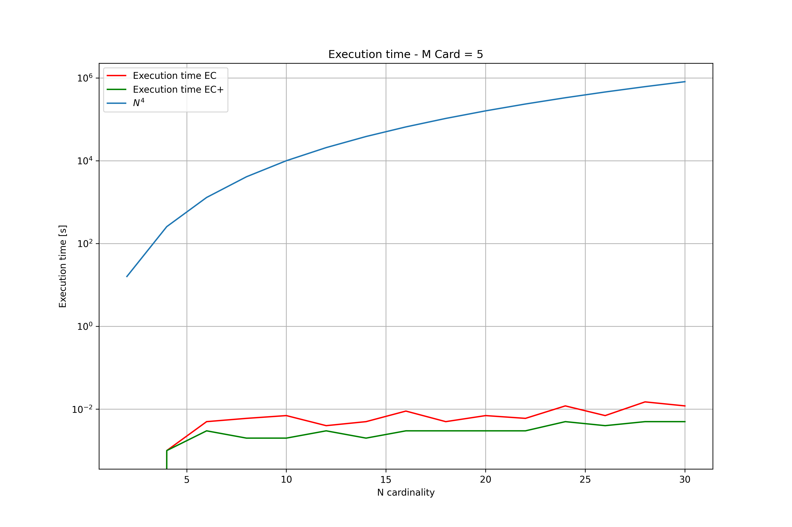 |
|:-----------------------:|
| *Cardinalità di M = 5)* |

|  |
|:-----------------------:|
| *Cardinalità di M = 6)* |

| 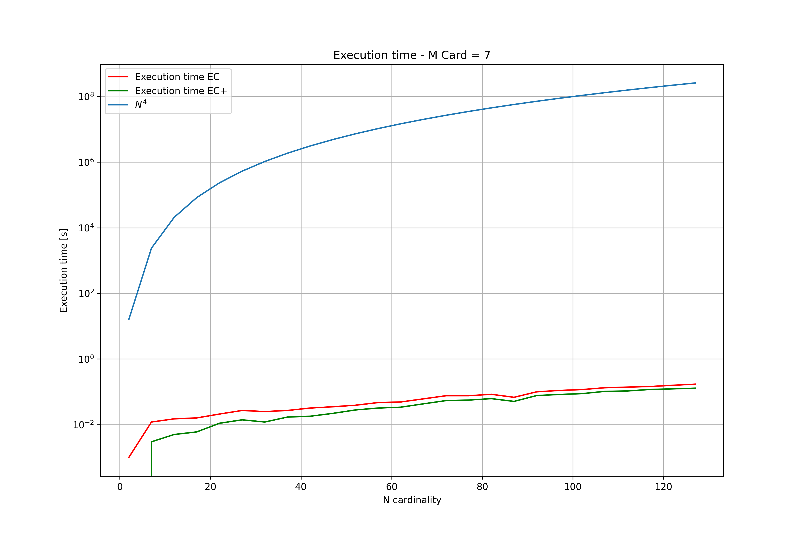 |
|:-----------------------:|
| *Cardinalità di M = 7)* |

|  |
|:-----------------------:|
| *Cardinalità di M = 8)* |

| 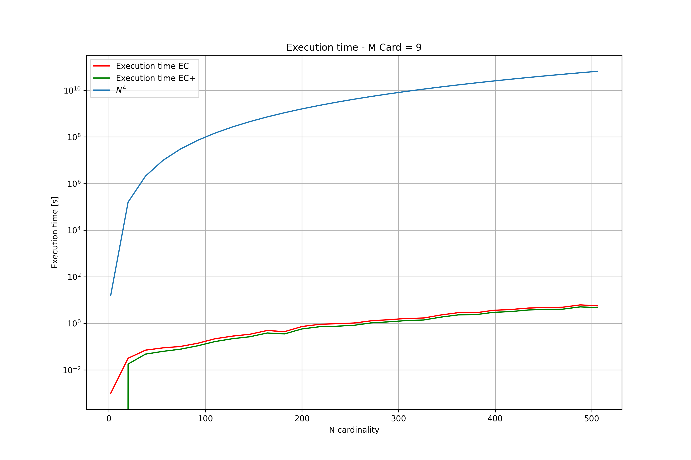 |
|:-----------------------:|
| *Cardinalità di M = 9)* |

| 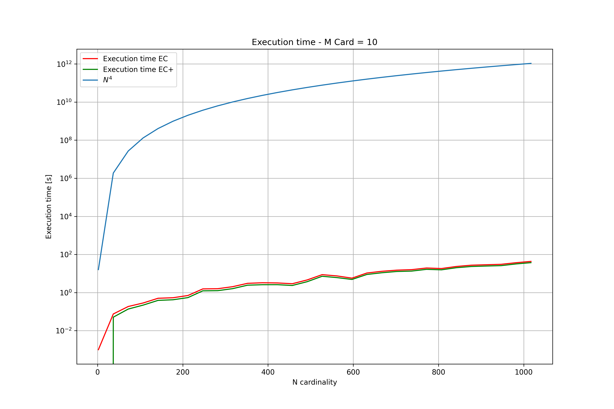 |
|:------------------------:|
| *Cardinalità di M = 10)* |

|  |
|:------------------------:|
| *Cardinalità di M = 11)* |

|  |
|:------------------------:|
| *Cardinalità di M = 12)* |

|  |
|:------------------------:|
| *Cardinalità di M = 13)* |

|  |
|:------------------------:|
| *Cardinalità di M = 14)* |


Notiamo come i tempi di esecuzione di EC ed EC+ non sembrino sostanzialmente diversi, questo è dovuto al fatto che la modifica
di EC+ data al codice non va a modificare il numero di nodi visitati ma va solo a diminuire il numero di unioni tra righe
della matrice A (operazione che, con la libreria NumPy, non va ad appesantire il sistema in maniera critica); questo
determina un tempo di esecuzione minore ma non in maniera sostanziale.
Notiamo come la curva del tempo di esecuzione di entrambi gli algoritmi segue lo sviluppo della curva di $N^4$, quindi 
possiamo approssimare la complessità temporale di entrambi gli algoritmi con un $O(N^4)$.

### Numero di nodi visitati

| 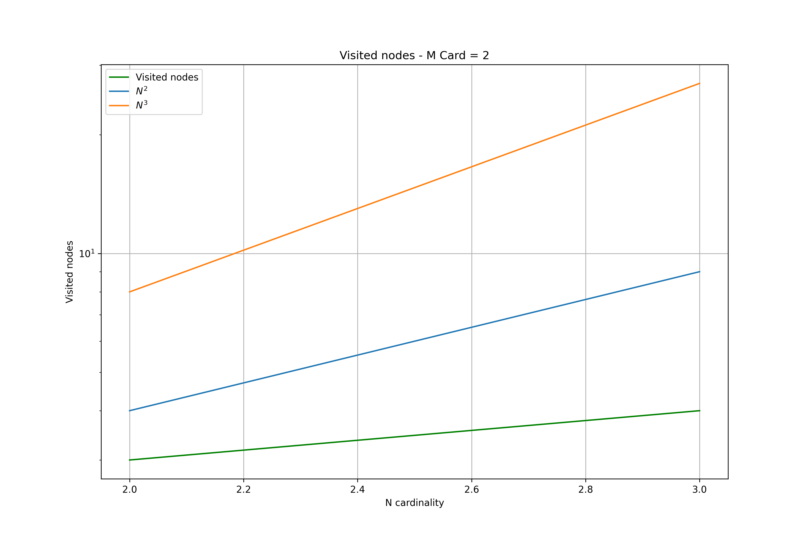 |
|:--------------------------:|
|  *Cardinalità di M = 2)*   |

|  |
|:--------------------------:|
|  *Cardinalità di M = 3)*   |

|  |
|:--------------------------:|
|  *Cardinalità di M = 4)*   |

|  |
|:--------------------------:|
|  *Cardinalità di M = 5)*   |

|  |
|:--------------------------:|
|  *Cardinalità di M = 6)*   |

|  |
|:--------------------------:|
|  *Cardinalità di M = 7)*   |

|  |
|:--------------------------:|
|  *Cardinalità di M = 8)*   |

| 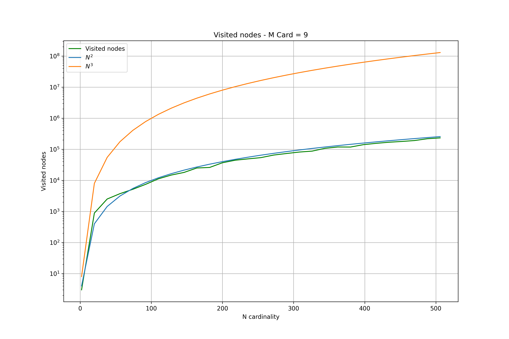 |
|:--------------------------:|
|  *Cardinalità di M = 9)*   |

| 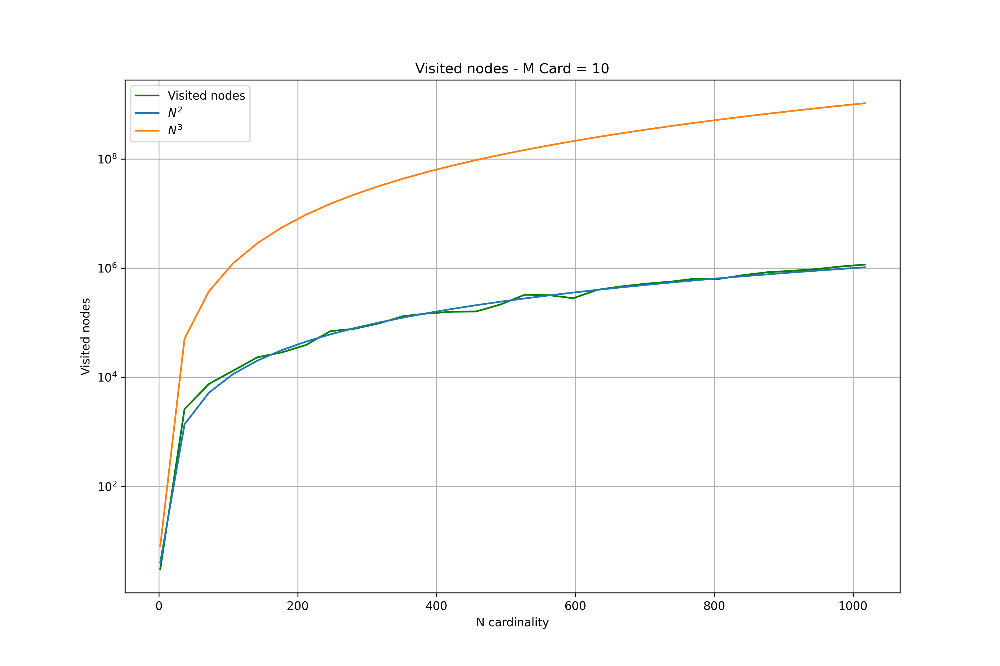 |
|:---------------------------:|
|  *Cardinalità di M = 10)*   |

| 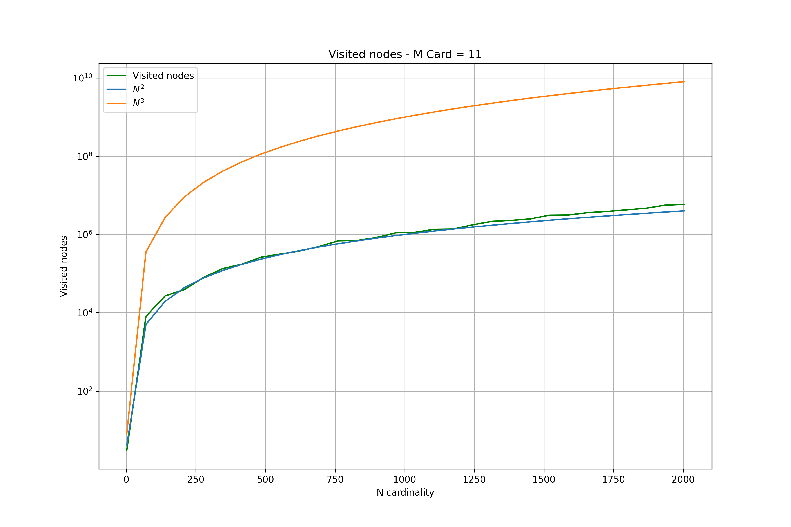 |
|:---------------------------:|
|  *Cardinalità di M = 11)*   |

|  |
|:---------------------------:|
|  *Cardinalità di M = 12)*   |

|  |
|:---------------------------:|
|  *Cardinalità di M = 13)*   |

|  |
|:---------------------------:|
|  *Cardinalità di M = 14)*   |


Notiamo come, all'aumentare della cardinalità di M, la curva verde tende ad approssimarsi alla curva di $N^3$.
Questo va a denotare come il numero di nodi visitati tende ad aumentare in maniera esponenziale al crescere della
cardinalità di M e N.


### Occupazione di memoria RAM

|   |
|:-----------------------:|
| *Cardinalità di M = 2)* |

| 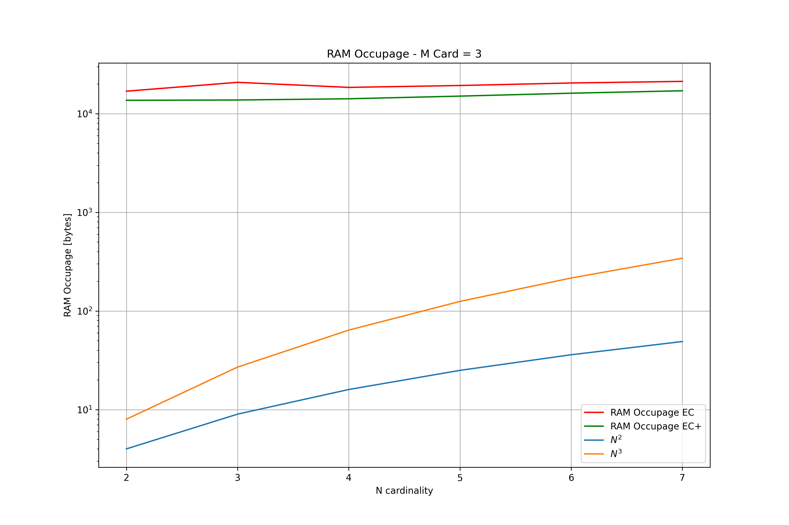  |
|:-----------------------:|
| *Cardinalità di M = 3)* |

|   |
|:-----------------------:|
| *Cardinalità di M = 4)* |

|   |
|:-----------------------:|
| *Cardinalità di M = 5)* |

| 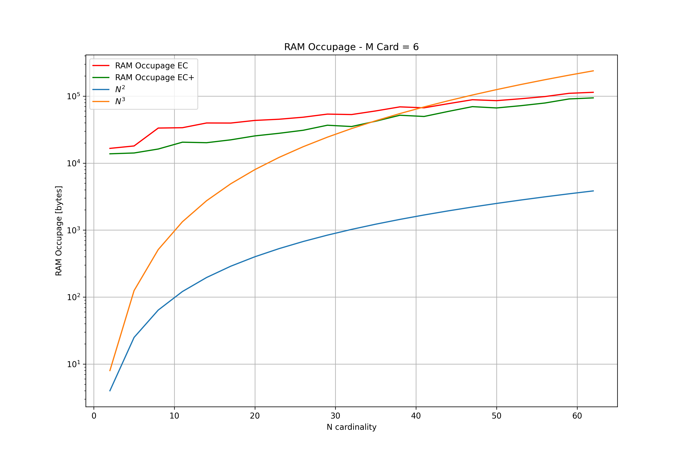  |
|:-----------------------:|
| *Cardinalità di M = 6)* |

| 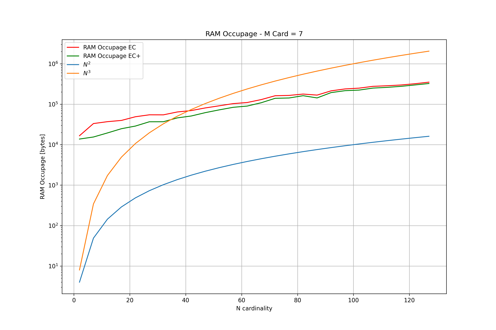  |
|:-----------------------:|
| *Cardinalità di M = 7)* |

|   |
|:-----------------------:|
| *Cardinalità di M = 8)* |

|   |
|:-----------------------:|
| *Cardinalità di M = 9)* |

|   |
|:------------------------:|
| *Cardinalità di M = 10)* |

| 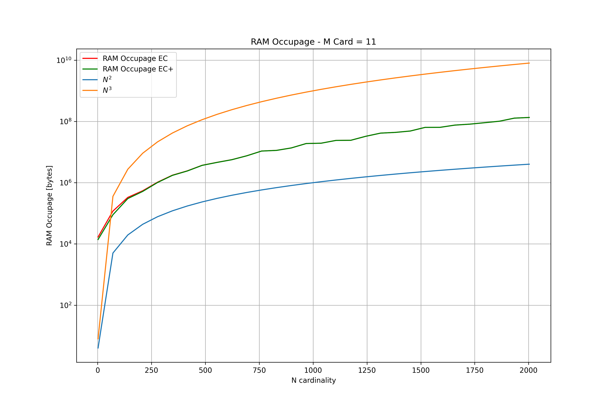  |
|:------------------------:|
| *Cardinalità di M = 11)* |

|   |
|:------------------------:|
| *Cardinalità di M = 12)* |

jbb


## Conclusioni

Ho notato come all'aumentare di M e N le complessità temporali e spaziali tendono
ai valori teorici espressi dalla matematica di questo problema NP completo. L'analisi e la
realizzazione di un algoritmo (seguendo le pseudocodice fornito dalla Prof.ssa Zanella) 
risolvente questo problema mi ha permesso di capire meglio come la realizzazione di algoritmi
a bassa complessità spaziale e temporale sia un campo di studio e settore di ricerca molto
attivo e interessante, dove si può veramente dire che *il tempo è denaro* in quanto il CPU Time
che viene usato per la risoluzione del problema è veramente una risorsa critica e la sua
minimizzazione deve essere una delle principali preoccupazioni di tutti i programmatori!

&copy; Glisenti Mirko - Mat: 723210 - Università degli Studi di Brescia (2022)